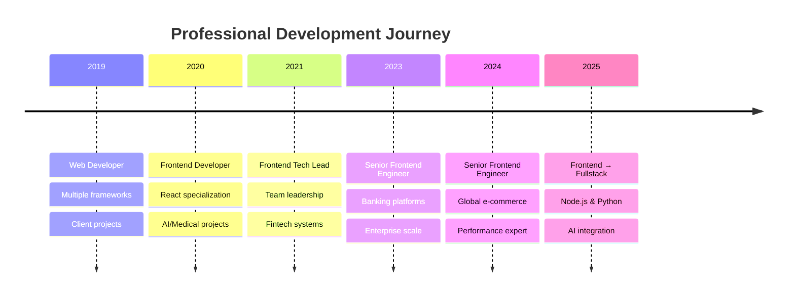

# Hi, I'm Osvaldo 👋
### Fullstack Developer


**Senior Frontend Engineer** with **7+ years** building scalable web applications for **fintech, e-commerce, and SaaS platforms**. Currently transitioning to **fullstack development** with expertise in **Node.js and Python/Django**. 

🌍 **Remote Work Specialist** | 🕐 **GMT-6 (Perfect for US teams)** | 💬 **Fluent English**

---

## 🏢 **Enterprise Development Experience**

> **Note**: Most of my professional work is in private enterprise repositories due to company policies and financial regulations. My public GitHub activity represents only a small portion of my actual development work.

**Professional Background:**
- 🏦 **Banking & Fintech**: Built systems for **Invex Bank**, **Gentera/Compartamos Bank** 
- 🛒 **E-commerce**: Optimized platforms for **Stitchfix** (via Unosquare)
- ⛪ **SaaS**: Led frontend redesign for **Life.Church** platform
- 💼 **B2B Fintech**: Technical lead at **Fondeadora for Business**
- 🍼 **Current**: Senior Frontend Engineer at **Pandora's Way**

---

## 📊 **Professional Stats & Achievements**

<div align="center">


</div>

<div align="center">

### 🎯 **Core Specializations**


</div>

---

## 🛠 **Technology Stack & Languages**

<div align="center">


</div>

**Frontend Mastery**  


**Backend & Fullstack**  


**DevOps & Enterprise**  


**Enterprise Skills**  


---

## 🏆 **Professional Achievement Badges**

<div align="center">


</div>

---

## 💼 **Featured Enterprise Projects**

*Due to NDA agreements and financial regulations, specific code and live demos cannot be shared publicly. Below are professional project overviews:*

### 🏦 **Banking Platform Migration** | *Major Mexican Bank*
```
Challenge: Modernize legacy banking system to micro-frontend architecture
My Role:   Led frontend migration strategy and implementation  
Stack:     React, TypeScript, Microservices, PCI DSS compliance
Impact:    Served enterprise banking clients with zero-downtime deployment
```

### 💸 **Financial Inclusion Platform** | *LatAm Fintech*
```
Challenge: Build mobile-first platform for underbanked populations
My Role:   Frontend architecture with offline-first capabilities
Stack:     React Native, RealmDB, Django APIs, Encryption
Impact:    Expanded financial services access in underserved communities
```

### 🛒 **E-commerce Optimization** | *Global Fashion Platform*
```
Challenge: Improve performance and user experience for millions of users
My Role:   Frontend optimization and headless CMS integration  
Stack:     React, Next.js, Contentstack, A/B Testing
Impact:    Delivered measurable performance and engagement improvements
```

### 💼 **B2B Financial Management** | *Mexican Fintech Startup*
```
Challenge: Build comprehensive financial platform from ground-up
My Role:   Technical lead for frontend development and team mentoring
Stack:     React, Redux Sagas, Node.js, AWS
Impact:    Successful product launch serving business customers
```

---

## 📈 **Professional Journey Timeline**

<div align="center">



</div>

---

## 🎯 **Current Learning & Innovation**

<div align="center">


</div>

- **AI-Enhanced Development**: Mastering Cursor, Windsurf, and ChatGPT for productivity
- **Fullstack Growth**: Expanding backend expertise with Node.js, Python, and cloud architectures  
- **AWS Certification**: Working towards Cloud Practitioner certification
- **Open Source**: Planning to contribute more to public projects while respecting professional obligations

---

## 🔮 **Why My GitHub Activity Looks Different**

<div align="center">


</div>

**Most developers work in one of two environments:**

🌐 **Open Source Developers**: High public GitHub activity, visible contributions  
🏢 **Enterprise Developers**: Private repositories, confidential projects, NDAs

I fall into the **enterprise category** - my professional work involves:
- ✅ Banking systems with strict security requirements
- ✅ Financial platforms with regulatory compliance  
- ✅ Proprietary business applications
- ✅ Large-scale systems serving real customers with real money

**This means**: My GitHub doesn't reflect thousands of commits to private enterprise repositories, but it represents solid, professional, revenue-generating development work.

---

## 🤝 **Let's Connect & Collaborate**

<div align="center">

[](mailto:luisosvaldopineda@gmail.com)  
[](https://linkedin.com/in/osvaldo-pineda)  

</div>

---

## 💼 **Open to Opportunities**

<div align="center">


</div>

> **Seeking remote Senior Frontend, Fullstack Developer, or Technical Lead roles**  
> **Languages**: Spanish (Native), English (Fluent)  
> **Availability**: Immediate for part-time, 30-day notice for full-time

**Ideal for companies building fintech, e-commerce, or SaaS solutions that need:**
- ✅ Enterprise-grade development experience
- ✅ Financial compliance and security expertise  
- ✅ Scalable frontend architectures
- ✅ Remote team leadership capabilities
- ✅ Proven track record with real business impact

---

<div align="center">

### 📫 Ready to discuss your next project?
**Let's build something amazing together!**


</div>
