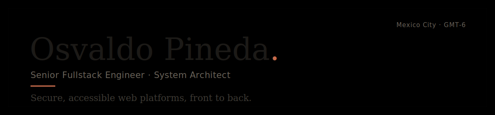
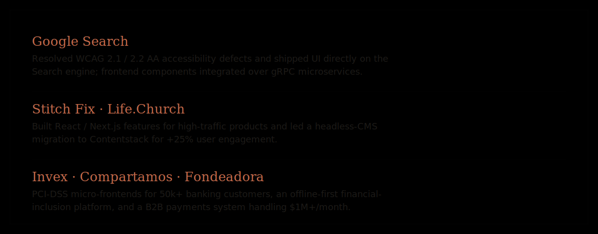
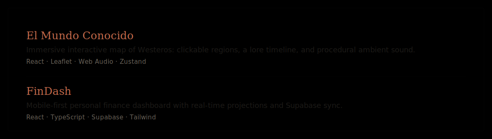
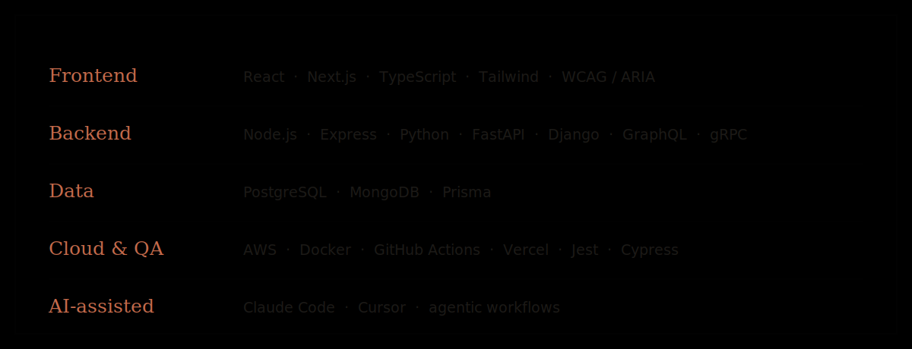

<picture>
  <source media="(prefers-color-scheme: dark)" srcset="./header-dark.svg">
  
</picture>

Seven years architecting scalable applications across the React ecosystem, robust Node and Python backends, and compliance-heavy fintech systems. Based in Mexico City (GMT-6), open to remote, B2B and relocation.

### Selected work

<picture>
  <source media="(prefers-color-scheme: dark)" srcset="./work-dark.svg">
  
</picture>

### Building

<picture>
  <source media="(prefers-color-scheme: dark)" srcset="./building-dark.svg">
  
</picture>

**Live** &nbsp;[El Mundo Conocido](https://asoiaf-map.pages.dev) &nbsp;·&nbsp; [FinDash](https://findash-icc.pages.dev)

### Stack

<picture>
  <source media="(prefers-color-scheme: dark)" srcset="./stack-dark.svg">
  
</picture>

### Connect

[Portfolio](https://me.pinedawebstudio.com) &nbsp;·&nbsp; [LinkedIn](https://linkedin.com/in/osvaldo-pineda) &nbsp;·&nbsp; [Email](mailto:luisosvaldopineda@gmail.com)
